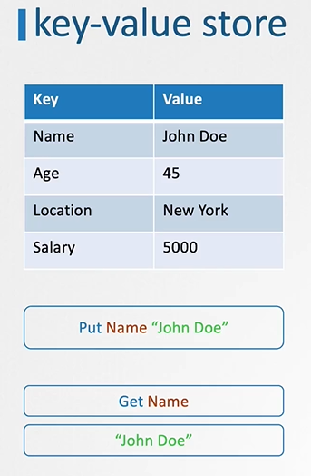
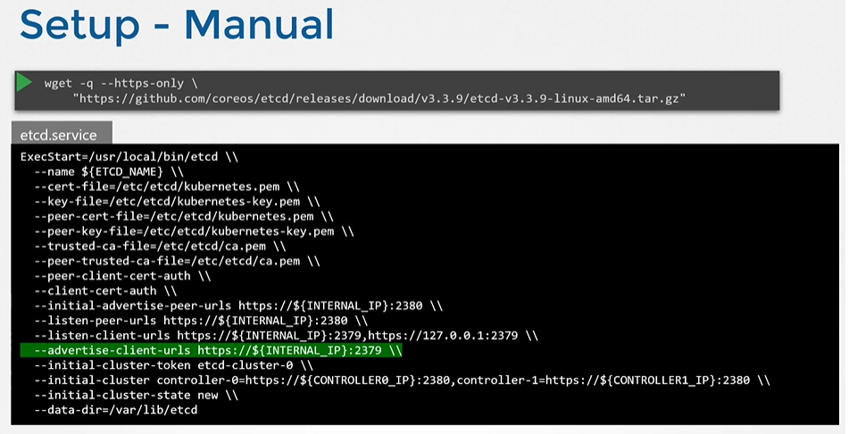
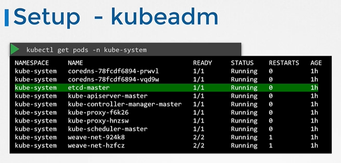

# ETCD for Beginners

  In this section, we will take a quick look at introduction to ETCD for beginners. 
  - What is ETCD?
  - What is a Key-Value Store?
  - How to get started quickly with ETCD?
  - How to operate ETCD?
  
 ## What is a ETCD?
     - ETCD is a distributed reliable key-value store that is simple, secure & Fast.
     
## What is a Key-Value Store
   - Traditionally, databases have been in tabular format, you must have heared about SQL or Relational databases. They store data in rows and columns
       
     
     
   - A Key-Value Store stores information in a Key and Value format.
       
     
       
## Install ETCD
   - Its easy to install and get started with **`ETCD`**.
     - Download the relevant binary for your operating system from github releases page (https://github.com/etcd-io/etcd/releases)
       ```
       For Example: To download ETCD V3.3.11, run the below curl command
         
       $ https://github.com/etcd-io/etcd/releases/download/v3.3.11/etcd-v3.3.11-linux-amd64.tar.gz
       ```
     - Extract it.
       ```
       $ tar xvzf etcd-v3.3.11-linux-amd64.tar.gz 
       ```
     - Run the ETCD Service
       ```
       $ ./etcd
       ```
     - When you start **`ETCD`** it will by default listens on port **`2379`**
      - The default client that comes with **`ETCD`** is the [**`etcdctl`**](https://github.com/etcd-io/etcd/tree/main/etcdctl) client. You can use it to store and retrieve key-value pairs.
        ```
        Syntax: To Store a Key-Value pair
        $ ./etcdctl set key1 value1
        ```
        ```
        Syntax: To retrieve the stored data
        $ ./etcdctl get key1
        ```
        ```
        Syntax: To view more commands. Run etcdctl without any arguments
        $ ./etcdctl
        ```
        
        
        
       K8s Reference Docs:
       - https://kubernetes.io/docs/concepts/overview/components/
       - https://etcd.io/docs/
       - https://kubernetes.io/docs/tasks/administer-cluster/configure-upgrade-etcd/
       


# ETCD in Kubernetes

In this section, we will take a look at ETCD role in kubernetes

## ETCD Datastore
- The ETCD Datastore stores information regarding the cluster such as **`Nodes`**, **`PODS`**, **`Configs`**, **`Secrets`**, **`Accounts`**, **`Roles`**, **`Bindings`** and **`Others`**.
- Every information you see when you run the **`kubectl get`** command is from the **`ETCD Server`**.

## Setup - Manual
- If you setup your cluster from scratch then you deploy **`ETCD`** by downloading ETCD Binaries yourself
- Installing Binaries and Configuring ETCD as a service in your master node yourself.
  ```
  $ wget -q --https-only "https://github.com/etcd-io/etcd/releases/download/v3.3.11/etcd-v3.3.11-linux-amd64.tar.gz"
  ```

  
  
## Setup - Kubeadm
- If you setup your cluster using **`kubeadm`** then kubeadm will deploy etcd server for you as a pod in **`kube-system`** namespace.
  ```
  $ kubectl get pods -n kube-system
  ```
  

## Explore ETCD
- To list all keys stored by kubernetes, run the below command
  ```
  $ kubectl exec etcd-master -n kube-system etcdctl get / --prefix -key
  ```
- Kubernetes Stores data in a specific directory structure, the root directory is the **`registry`** and under that you have varies kubernetes constructs such as **`minions`**, **`nodes`**, **`pods`**, **`replicasets`**, **`deployments`**, **`roles`**, **`secrets`** and **`Others`**.
  
  

## ETCD in HA Environment
   - In a high availability environment, you will have multiple master nodes in your cluster that will have multiple ETCD Instances spread across the master nodes.
   - Make sure etcd instances know each other by setting the right parameter in the **`etcd.service`** configuration. The **`--initial-cluster`** option where you need to specify the different instances of the etcd service.
     


# ETCD – Commands (Optional)

- (Optional) Additional information about ETCDCTL UtilityETCDCTL is the CLI tool used to interact with ETCD.ETCDCTL can interact with ETCD Server using 2 API versions – Version 2 and Version 3.  By default it’s set to use Version 2. Each version has different sets of commands.

- For example, ETCDCTL version 2 supports the following commands:

```
etcdctl backup
etcdctl cluster-health
etcdctl mk
etcdctl mkdir
etcdctl set
```

- Whereas the commands are different in version 3

```
etcdctl snapshot save
etcdctl endpoint health
etcdctl get
etcdctl put
```

- To set the right version of API set the environment variable ETCDCTL_API command

` export ETCDCTL_API=3`  

- When the API version is not set, it is assumed to be set to version 2. And version 3 commands listed above don’t work. When API version is set to version 3, version 2 commands listed above don’t work.

- Apart from that, you must also specify the path to certificate files so that ETCDCTL can authenticate to the ETCD API Server. The certificate files are available in the etcd-master at the following path. We discuss more about certificates in the security section of this course. So don’t worry if this looks complex:

```
--cacert /etc/kubernetes/pki/etcd/ca.crt
--cert /etc/kubernetes/pki/etcd/server.crt
--key /etc/kubernetes/pki/etcd/server.key
```


- So for the commands, I showed in the previous video to work you must specify the ETCDCTL API version and path to certificate files. Below is the final form:

```
kubectl exec etcd-controlplane -n kube-system -- sh -c "ETCDCTL_API=3 etcdctl get / --prefix --keys-only --limit=10 --cacert /etc/kubernetes/pki/etcd/ca.crt --cert /etc/kubernetes/pki/etcd/server.crt --key /etc/kubernetes/pki/etcd/server.key"
```


K8s Reference Docs:
- https://kubernetes.io/docs/tasks/administer-cluster/configure-upgrade-etcd/
- https://kubernetes.io/docs/setup/production-environment/tools/kubeadm/setup-ha-etcd-with-kubeadm/
- https://kubernetes.io/docs/setup/production-environment/tools/kubeadm/high-availability/#stacked-control-plane-and-etcd-nodes
- https://kubernetes.io/docs/setup/production-environment/tools/kubeadm/high-availability/#external-etcd-nodes
