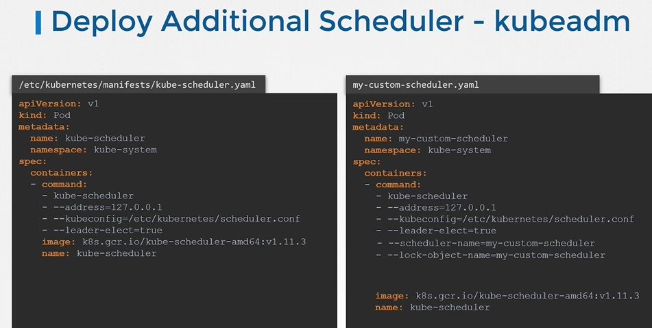
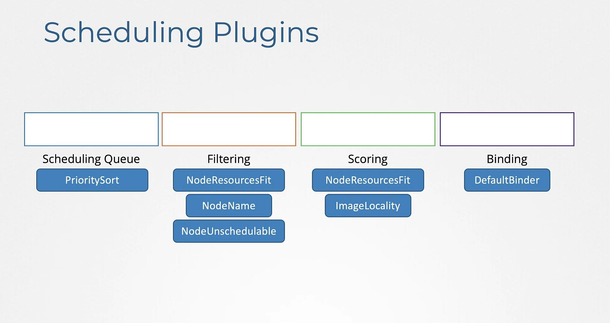
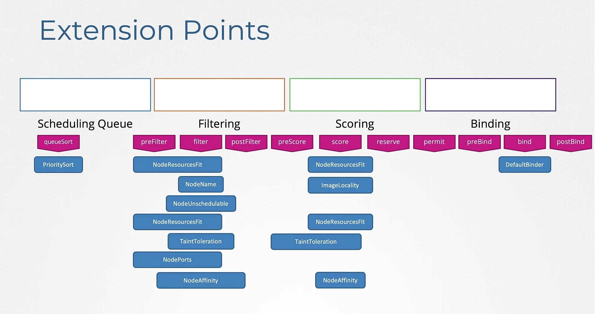
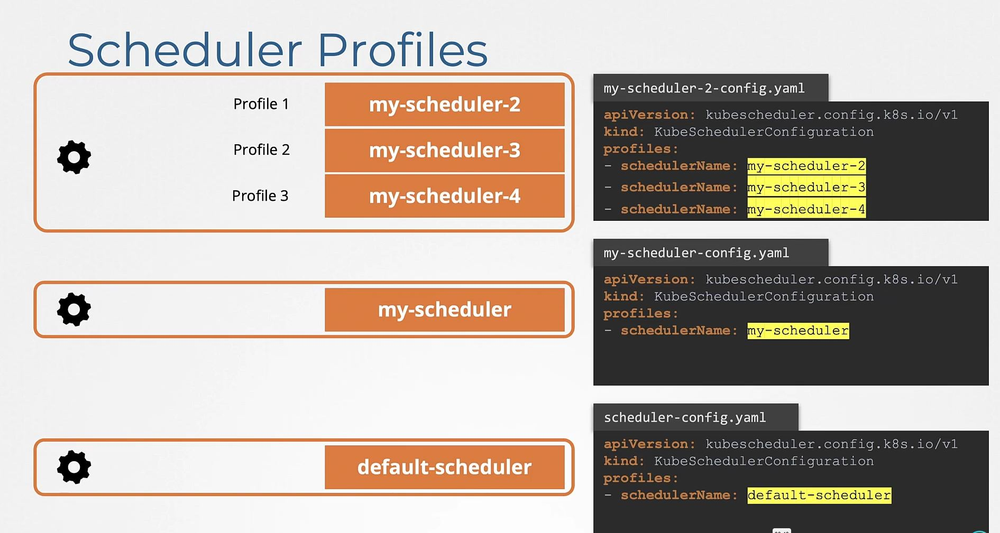
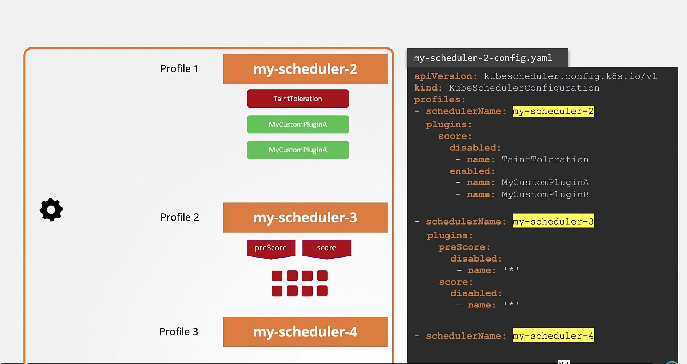

# Configuring Kubernetes Schedulers
  
In this section, we will take a look at configuring kubernetes schedulers.

Scheduling Plugins

Extension Points

Configure Multiple Schedulers in a single scheduler-file

## References
- https://github.com/kubernetes/community/blob/master/contributors/devel/sig-scheduling/scheduler.md
- https://kubernetes.io/blog/2017/03/advanced-scheduling-in-kubernetes/
- https://jvns.ca/blog/2017/07/27/how-does-the-kubernetes-scheduler-work/
- https://stackoverflow.com/questions/28857993/how-does-kubernetes-scheduler-work

